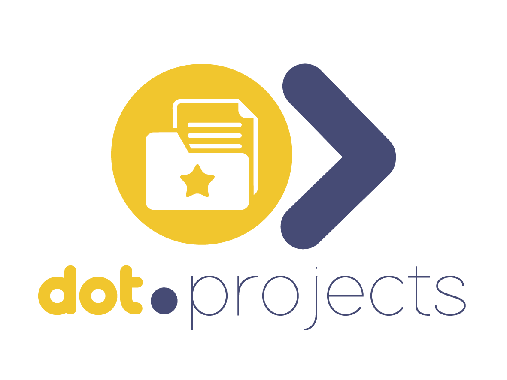

<div align="center">



<br /><br />

**Plan, track, and deliver projects with intelligent milestone generation.**

<br />

   

<br /><br />

**Part of the [InfoDot Ecosystem](https://github.com/sakhileb/InfoDot)** &nbsp;·&nbsp; `projects.infodot.app`

</div>

---

## What is Dot.Projects?

Dot.Projects is the project management platform in the InfoDot ecosystem. AI-powered milestone generation turns a project brief into a structured plan instantly; a drag-and-drop kanban board keeps teams moving toward delivery with full visibility.

## Core Features

**Shipped:**
- AI milestone generation — input a brief, get a full project plan (with a deterministic mock fallback when no API key is configured, and a full prompt/response audit log per generation)
- Drag-and-drop kanban board with assignee, priority, and milestone tagging
- Task assignment to team members, with an in-app notification
- Project and task comments, with an in-app notification to the project owner
- In-app notification bell (database channel) — milestone due-soon reminders, new comments, task assignments
- Dashboard search and status filtering across a team's projects
- Light/dark theme toggle
- Ecosystem SSO from the InfoDot hub

**Not yet built** (see `wiki.md` for the full gap analysis against the target design):
- Gantt timeline view with dependency tracking
- Time logging per task linked to billing
- Knowledge Pack publishing / event emission to Dot.Brain
- Dot.Tasks spawn/escalate handoff

## Domain Models

- **Project** — scoped initiative with status, belongs to a `Team`
- **Milestone** — key delivery checkpoint on a project
- **ProjectTask** — kanban work item with assignee, priority, and status
- **ProjectComment** — polymorphic discussion thread on a `Project` or `ProjectTask`
- **AiPlanLog** — full prompt/response audit trail per AI plan generation

## Tech Stack

| Layer | Technology |
|---|---|
| Framework | Laravel 12 |
| Language | PHP 8.4 |
| Frontend | Livewire 3 · Alpine.js 3 · Tailwind CSS |
| Database | PostgreSQL 16 (shared across ecosystem) |
| Realtime | Laravel Reverb (configured, not yet wired to board updates) |
| Auth | Laravel Sanctum (InfoDot SSO) + Jetstream teams |
| AI | Anthropic Claude (`claude-sonnet-4-6`), mock fallback if unconfigured |
| Notifications | Laravel's built-in `database` notification channel |
| Queue | Redis · Laravel Horizon (configured in `.env.example`) |

## Quick Start

```bash
git clone https://github.com/sakhileb/Dot.Projects.git
cd Dot.Projects
cp .env.example .env
composer install
npm install && npm run build
php artisan key:generate
php artisan migrate
php artisan serve
```

> **Ecosystem SSO:** Set `DB_*` env vars to the shared InfoDot PostgreSQL instance and `APP_URL=https://projects.infodot.app`. Users authenticated through InfoDot gain access automatically via Sanctum handoff tokens.

## Ecosystem

**Dot.Projects** is one of **21 platforms** in the InfoDot ecosystem, connected via shared PostgreSQL and Sanctum SSO. Visit [InfoDot](https://github.com/sakhileb/InfoDot) to explore the full platform map.

## License

MIT © [SK Digital / BluPin Incorporated](https://github.com/sakhileb)
